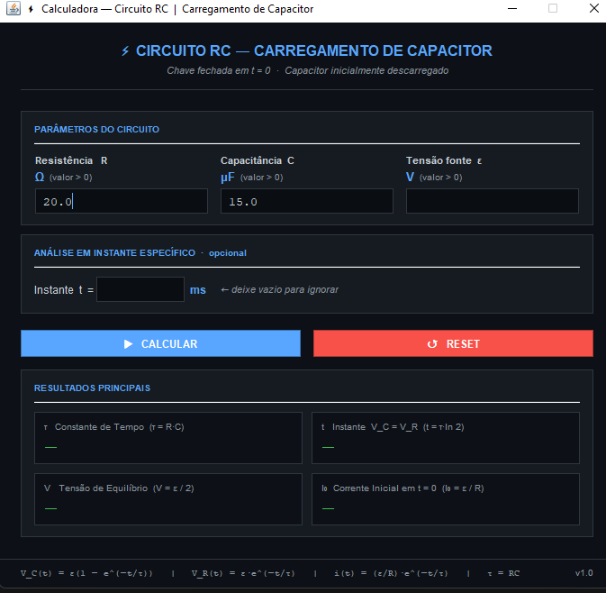

# ⚡ Calculadora de Física — Circuito RC

Uma calculadora feita em Java com interface gráfica (JFrame/Swing) desenvolvida como projeto da disciplina de Física.

Resolve o problema de **carregamento de capacitor** em um circuito RC com base nas equações de tensão, corrente e carga variantes no tempo.

---

## 📋 Sobre o projeto

O programa foi criado a partir do seguinte exercício:

> *A chave S da Fig. 27.46 é fechada no instante t = 0, fazendo com que um capacitor inicialmente descarregado, de capacitância C = 15,0 μF, comece a se carregar através de um resistor de resistência R = 20,0 Ω. Em que instante a diferença de potencial entre os terminais do capacitor é igual à diferença de potencial entre os terminais do resistor?*

A calculadora generaliza o problema, permitindo inserir qualquer valor de R, C e tensão da fonte ε. Inclui ainda uma seção de análise opcional para qualquer instante t informado.

---

## 🖥️ Preview da interface



---

## ⚙️ Funcionalidades

- ✅ Interface gráfica com Java Swing — tema escuro (GitHub Dark)
- ✅ Cálculo da **constante de tempo** τ = R·C
- ✅ Cálculo do **instante de equilíbrio** t = τ·ln(2), onde V_C = V_R
- ✅ Cálculo da **tensão de equilíbrio** V = ε / 2
- ✅ Cálculo da **corrente inicial máxima** I₀ = ε / R
- ✅ Análise em **instante específico** (campo opcional em ms):
  - Tensão no capacitor V_C(t)
  - Tensão no resistor V_R(t)
  - Corrente i(t)
  - Carga armazenada q(t)
  - Porcentagem de carga do capacitor
- ✅ Validação de entradas com mensagens de erro descritivas
- ✅ Botões **CALCULAR** e **RESET**
- ✅ Formatação automática de tempo (s, ms ou µs)
- ✅ Código comentado em cada declaração de função

---

## 🗂️ Estrutura do projeto

```text
CalculadoraCircuitoRC/
├── README.md
└── src/
    ├── core/
    │   └── Main.java                # Ponto de entrada do programa
    └── entidade/
        ├── InterfaceGrafica.java    # Interface gráfica Swing/JFrame
        ├── CircuitoRC.java          # Cálculos físicos do circuito RC
        └── Validador.java           # Validação dos dados de entrada
```

---

## 🚀 Como executar

### Pré-requisitos
- Java JDK 8 ou superior instalado
- Terminal ou IDE como IntelliJ IDEA, Eclipse ou VS Code

### Via terminal

```bash
# Entre na pasta raiz do projeto
cd CalculadoraCircuitoRC

# Crie a pasta de saída
mkdir out

# Compile todos os arquivos (na ordem correta)
javac -d out src/entidade/CircuitoRC.java src/entidade/Validador.java src/entidade/InterfaceGrafica.java src/core/Main.java

# Execute o programa
java -cp out core.Main
```

### Via IntelliJ IDEA / Eclipse
1. Abra a pasta `CalculadoraCircuitoRC` como projeto
2. Localize a classe `Main.java` em `src/core/`
3. Clique com o botão direito → **Run 'Main'**

---

## 📐 Equações utilizadas

| Grandeza | Equação |
|---|---|
| Tensão no capacitor | V_C(t) = ε · (1 − e^(−t/τ)) |
| Tensão no resistor | V_R(t) = ε · e^(−t/τ) |
| Corrente no circuito | i(t) = (ε / R) · e^(−t/τ) |
| Carga no capacitor | q(t) = C · V_C(t) |
| Constante de tempo | τ = R · C |
| Instante de equilíbrio | t = τ · ln(2) |
| Porcentagem de carga | % = (V_C / ε) × 100 |

---

## 📥 Inputs aceitos

| Campo | Restrição |
|---|---|
| Resistência R (Ω) | > 0 |
| Capacitância C (μF) | > 0 |
| Tensão da fonte ε (V) | > 0 |
| Instante t (ms) | ≥ 0 — campo opcional |

Valores não numéricos e fora dos limites são rejeitados com mensagem de erro.  
Aceita vírgula ou ponto como separador decimal.

---

## 📤 Outputs fornecidos

**Resultados Principais:**
- τ — Constante de tempo (s, ms ou µs)
- t — Instante em que V_C = V_R
- V — Tensão de equilíbrio (= ε / 2)
- I₀ — Corrente máxima em t = 0

**Resultados no Instante t (quando informado):**
- V_C(t) — Tensão no capacitor (V)
- V_R(t) — Tensão no resistor (V)
- i(t) — Corrente no circuito (A)
- q(t) — Carga armazenada no capacitor (C)
- % — Porcentagem de carga do capacitor

---

## 👩‍💻 Autora

**Lorena Do Prado Rosa**  
Disciplina: Física — 1º Bimestre
